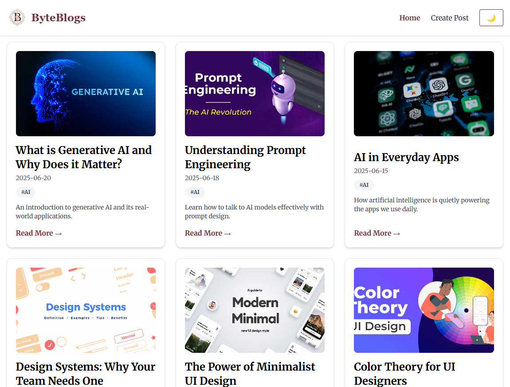

# ByteBlogs

A minimalist blog web app built with **Next.js** and **Tailwind CSS**. Allows users to add, view, and filter blog posts — all stored locally in the browser.

## Features

- Add new blog posts with title, summary, content, image, date, and category
- Filter and search blogs by category or title
- Dark mode support
- Clean and responsive UI

## Screenshots

### Home Page

Light Mode  


Dark Mode  


### Add Blog Page


### Blog Detail Page


## Getting Started

1. **Clone the repository**

   ```bash
   git clone https://github.com/Rudrax03/byteblogs.git
   cd byteblogs

   ```

2. **Install dependencies**

   ```bash
   npm install
   ```

3. **Run the development server**

   ```bash
   npm run dev
   ```

4. **Open in browser**
   Visit [http://localhost:3000](http://localhost:3000)

## Project Structure

```bash
.
├── components/        # Navbar, BlogCard
├── data/              # Static JSON blog data
├── pages/             # Home, Add Blog, Blog Details
├── public/            # Images, favicon, screenshots
└── styles/            # Tailwind + global CSS
```

## Blog Storage

- Blogs added by users are stored in **localStorage**
- Static blog entries are preloaded from `data/blogs.json`

## Built With

- [Next.js](https://nextjs.org)
- [Tailwind CSS](https://tailwindcss.com)


> ByteBlogs — Clean, fast, and local-first blogging.
